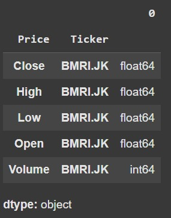
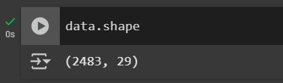
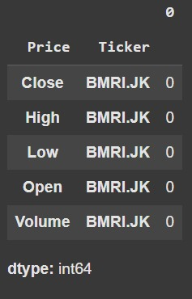
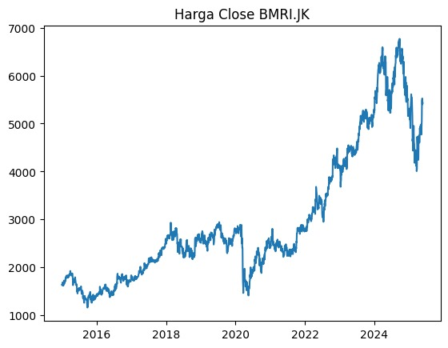
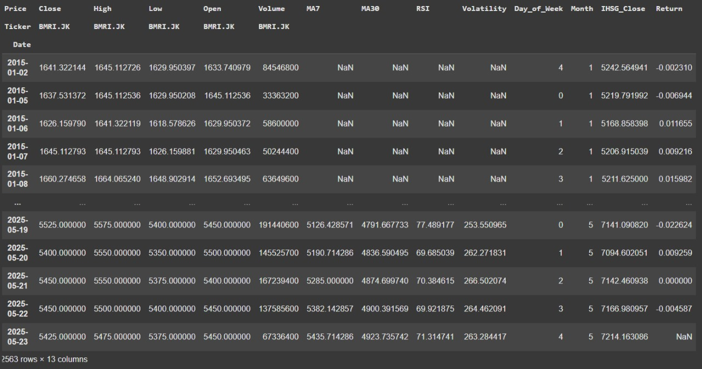
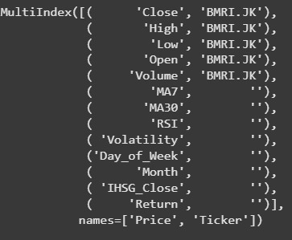
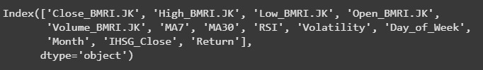
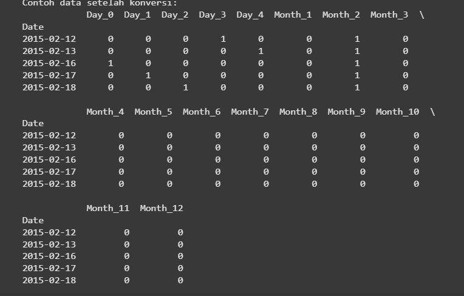

# Laporan Proyek Machine Learning Terapan 1 - Habib Fabri Arrosyid 

## Domain Proyek
Harga saham merupakan indikator penting dalam dunia keuangan yang mencerminkan performa perusahaan dan kondisi pasar. Dalam konteks pasar modal Indonesia, PT Bank Mandiri (Persero) Tbk, yang sahamnya diperdagangkan dengan kode BMRI.JK, adalah salah satu bank terbesar di Indonesia. Prediksi harga saham yang akurat dapat membantu investor, trader, dan institusi keuangan dalam pengambilan keputusan investasi, manajemen risiko, dan strategi perdagangan.

Pendekatan tradisional dalam analisis saham, seperti analisis fundamental dan teknikal, sering kali tidak cukup untuk menangkap pola kompleks dalam data harga saham yang bersifat non-linear dan dipengaruhi oleh berbagai faktor, seperti sentimen pasar, kebijakan ekonomi, dan peristiwa global. Oleh karena itu, pendekatan berbasis machine learning, khususnya model Long Short-Term Memory (LSTM), dapat digunakan untuk memodelkan data deret waktu (time series) harga saham, yang memungkinkan prediksi berdasarkan pola historis.

Proyek ini bertujuan untuk membangun model prediktif menggunakan LSTM untuk memprediksi harga penutupan saham BMRI.JK berdasarkan data historis yang diambil dari Yahoo Finance. Dengan memanfaatkan kemampuan LSTM dalam menangkap ketergantungan jangka panjang dalam data deret waktu, proyek ini diharapkan dapat memberikan wawasan yang berguna bagi investor untuk membuat keputusan yang lebih tepat waktu dan informed.

## Business Understanding
### Problem Statements
Berdasarkan latar belakang di atas, permasalahan yang akan dibahas dalam proyek ini adalah:

1. Bagaimana pola historis harga saham BMRI.JK (Close, High, Low, Open, Volume) dapat digunakan untuk memprediksi harga penutupan di masa depan?
2. Seberapa akurat model LSTM dalam memprediksi harga penutupan saham BMRI.JK berdasarkan data historis dari 2015 hingga 2025?
3. Faktor apa saja (dari fitur harga dan volume) yang paling berpengaruh dalam memprediksi harga penutupan saham?
4. Bagaimana performa model LSTM dibandingkan dengan metrik evaluasi seperti Mean Absolute Error (MAE) dan Mean Squared Error (MSE)?
5. Apakah model LSTM dapat digunakan untuk mendukung keputusan investasi jangka pendek atau jangka panjang?

### Goals
Berdasarkan problem statements, tujuan proyek ini adalah:

1. Mengidentifikasi pola dan tren dalam data historis harga saham BMRI.JK.
2. Membangun model LSTM yang akurat untuk memprediksi harga penutupan saham BMRI.JK.
3. Menentukan fitur yang paling berpengaruh terhadap prediksi harga penutupan.
4. Mengevaluasi performa model LSTM menggunakan metrik MAE dan MSE.
5. Menyediakan wawasan prediktif yang dapat mendukung keputusan investasi.

### Solution Statement
Melakukan Exploratory Data Analysis (EDA) untuk mengidentifikasi pola, tren, dan korelasi dalam data harga saham BMRI.JK.
Menggunakan model Long Short-Term Memory (LSTM) untuk memprediksi harga penutupan saham berdasarkan data historis.
Menggunakan metrik evaluasi seperti Mean Absolute Error (MAE) dan Mean Squared Error (MSE) untuk menilai performa model.
Melakukan normalisasi data menggunakan MinMaxScaler untuk memastikan data sesuai dengan kebutuhan model LSTM.
Mengoptimalkan model dengan Early Stopping dan penyesuaian hiperparameter untuk meningkatkan akurasi prediksi.

## Data Understanding
Dataset yang digunakan dalam proyek ini diambil dari Yahoo Finance menggunakan library yfinance dengan kode saham BMRI.JK. Data mencakup periode dari 1 Januari 2015 hingga 25 Mei 2025, berisi informasi harga saham harian yang terdiri dari 2563 baris dan 5 kolom: Close, High, Low, Open, dan Volume. Dataset ini bersifat deret waktu (time series) dan berisi data numerik tanpa nilai kategorikal.
#### Tipe Data
<br>
#### Bentuk Data
<br>

Deskripsi Variabel
Dataset memiliki 5 variabel dengan keterangan sebagai berikut:


Variabel  |	Keterangan
-----------|------------
Open  |	Harga pembukaan saham pada hari perdagangan (dalam IDR).
High  |	Harga tertinggi saham pada hari perdagangan (dalam IDR).
Low  |	Harga terendah saham pada hari perdagangan (dalam IDR).
Close  |	Harga penutupan saham pada hari perdagangan (dalam IDR, variabel target).
Volume  |	Jumlah saham yang diperdagangkan pada hari tersebut.

### Menangani Missing Value dan Duplicate Data
Pada tahap ini, dataset diperiksa untuk memastikan tidak ada nilai yang hilang (missing values) Berdasarkan analisis awal:
<br>
Tidak ada nilai yang hilang pada dataset (dikonfirmasi dengan data.isnull().sum()).
Tidak dilakukannya penghapusan nilai duplikat dikarenakan informasinya tetap berguna selama predictive modeling berbasis time series.

### Visualisasi Data EDA

Visualisasi data dilakukan menggunakan library matplotlib untuk melihat tren harga penutupan:
<br>

Interpretasi:

Harga penutupan menunjukkan tren kenaikan jangka panjang dengan beberapa periode volatilitas, terutama pada 2020 (kemungkinan akibat pandemi COVID-19).
Tidak ada outlier ekstrem yang terdeteksi dalam data harga.
Multivariate Analysis EDA
Analisis multivariat dilakukan untuk memahami hubungan antar variabel:

## Data Preparation
### Feature Engineering:
1. MA7, M30
MA7 dan MA30 membantu model mengenali tren jangka pendek dan panjang, 
2. RSI
RSI mengidentifikasi kondisi overbought/oversold untuk prediksi pembalikan harga
4. Volatility
Volatilitas memberikan informasi tentang fluktuasi pasar, sehingga model dapat lebih memahami dinamika pasar dan menghasilkan prediksi yang lebih akurat serta relevan dengan logika analisis saham.
6. Return
Memberikan informasi tentang persentase kenaikan atau penurunan harga penutupan dari satu hari ke hari berikutnya

Data yang terbentuk : 
<br>

Karena masih terdapat nilai null, maka dilakukan pembersihan nilai null pada data kemudian dilakukan penyederhanaan nama kolom agar mudah diidentifikasikan ketika menjadi fitur <br>
Penamaan kolom sebelum disederhanakan <br>
<br>
Penamaan kolom setelah disederhanakan <br>
<br>
Sebelum dimasukkan pemodelan dilakukan kembali pemrosesan seperti berikut : 
```
numeric_columns = [
    'Open_BMRI.JK', 'High_BMRI.JK', 'Low_BMRI.JK', 'Close_BMRI.JK', 
    'Volume_BMRI.JK', 'MA7', 'MA30', 'RSI', 'Volatility', 'IHSG_Close'
]

# Kolom target
target = 'Return'

# Normalisasi fitur
feature_scaler = MinMaxScaler()
data[numeric_columns] = feature_scaler.fit_transform(data[numeric_columns])

# Normalisasi target (Return) secara terpisah
target_scaler = MinMaxScaler()
data['Scaled_Return'] = target_scaler.fit_transform(data[[target]])

# One-hot encoding untuk kolom kategorikal
data = pd.get_dummies(data, columns=['Day_of_Week', 'Month'], prefix=['Day', 'Month'])

# Hapus baris dengan nilai NaN (akibat feature engineering atau shift)
data = data.dropna()

# Tampilkan kolom untuk memastikan
print("Kolom setelah normalisasi dan encoding:", data.columns.tolist())
```

Dilakukan pra-pemrosesan data untuk proyek prediksi harga saham BMRI.JK dengan model LSTM, dengan langkah-langkah berikut: 
1. Mendefinisikan kolom numerik seperti Open_BMRI.JK, Close_BMRI.JK, MA7, RSI, dan IHSG_Close untuk dinormalisasi menggunakan MinMaxScaler agar nilainya berada dalam rentang [0,1], sehingga model dapat belajar lebih baik dengan skala yang konsisten
2. Menormalisasi kolom target Return secara terpisah menggunakan scaler berbeda untuk menjaga integritas data target;
3. Menerapkan one-hot encoding pada kolom kategorikal Day_of_Week dan Month untuk mengubah data kategorikal menjadi format numerik yang dapat diproses oleh model;
4. Menghapus baris dengan nilai NaN yang muncul akibat feature engineering (seperti MA30 atau shift pada Return);
5. Menampilkan daftar kolom untuk memastikan transformasi berhasil.

Kemudian dilakukan konversi false dan true menjadi bentuk boolean agar dapat diproses oleh sistem
```
# Asumsi 'data' adalah DataFrame setelah one-hot encoding
# Identifikasi kolom boolean (Day_* dan Month_*)
boolean_columns = [col for col in data.columns if col.startswith('Day_') or col.startswith('Month_')]

# Ubah False/True menjadi 0/1
for col in boolean_columns:  # Perbaikan: ganti 'boolean Benutzercolumns' menjadi 'boolean_columns'
    data[col] = data[col].astype(int)

# Verifikasi perubahan
print("Tipe data setelah konversi:")
print(data[boolean_columns].dtypes)
print("\nContoh data setelah konversi:")
print(data[boolean_columns].head())
```
Didapatkan hasil sebagai berikut : <br> 
<br>

## Pemodelan
### Arsitektur LSTM pengujian pertama


Grafik menunjukkan bahwa prediksi model mengikuti tren aktual dengan cukup baik, meskipun terdapat beberapa penyimpangan pada periode volatilitas tinggi.
Kesimpulan
Berdasarkan hasil analisis dan pengujian model, kesimpulan dari proyek ini adalah:

Data historis harga saham BMRI.JK menunjukkan tren kenaikan jangka panjang dengan fluktuasi yang signifikan, yang dapat dimodelkan menggunakan LSTM.
Model LSTM mampu memprediksi harga penutupan saham dengan akurasi yang baik, dengan MAE pada data pengujian sekitar 75.67 IDR, menunjukkan bahwa prediksi cukup dekat dengan nilai aktual.
Fitur harga penutupan (Close) sebagai input utama sudah cukup untuk menghasilkan prediksi yang akurat, tetapi penambahan fitur lain seperti Volume atau indikator teknikal dapat dipertimbangkan untuk meningkatkan performa.
Metrik evaluasi MAE dan MSE menunjukkan bahwa model lebih akurat pada data pelatihan dibandingkan data pengujian, yang wajar karena data pengujian mencerminkan kondisi pasar yang belum pernah dilihat model.
Model LSTM dapat digunakan untuk mendukung keputusan investasi jangka pendek, tetapi untuk jangka panjang, perlu mempertimbangkan faktor eksternal seperti kebijakan ekonomi dan sentimen pasar.
Untuk meningkatkan performa model, dapat dilakukan eksperimen dengan penambahan fitur (misalnya, indikator teknikal seperti RSI atau MACD), penyesuaian hiperparameter, atau penggunaan model ensemble.
Referensi
Brownlee, J. (2020). Deep Learning for Time Series Forecasting. Machine Learning Mastery. Diakses pada 25 Mei 2025 dari https://machinelearningmastery.com/deep-learning-for-time-series-forecasting/.
Dicoding. (2024). Machine Learning Terapan. Diakses pada 25 Mei 2025 dari https://www.dicoding.com/academies/319-machine-learning-terapan.
Yahoo Finance. (2025). BMRI.JK Historical Data. Diakses pada 25 Mei 2025 dari https://finance.yahoo.com/quote/BMRI.JK/history/.
